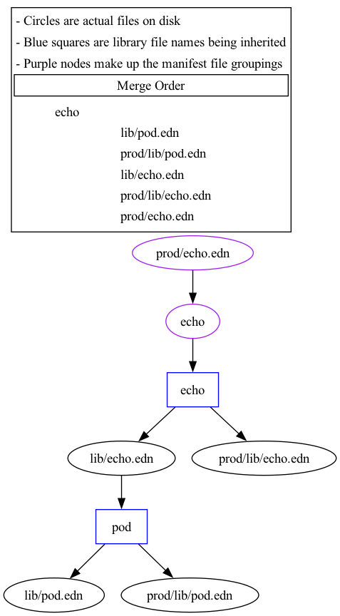

# CLI and Configuration

The main way to interact with Lighthouse is via its CLI tool `lh`. This tool provides ways to:

- build/render library or manifest files
- visualize library or manifest files
- update manifests in-place

## Configuration

For each file `lh` operates on, it will search up the directory tree for a `lighthouse.edn` file.

These `lighthouse.edn` files are used to configure `lighthouse`. The defaults for this file can be found [here](/src/lh/config.clj).

| Setting             | Description                                                                     |
| ------------------- | ------------------------------------------------------------------------------- |
| `:library-prefix`   | used to denote library files                                                    |
| `:metadata-prefix`  | used to denote metadata files                                                   |
| `:namespaces`       | defines all namespaces `lighthouse` uses                                        |
| `:output-prefix`    | used to define where renderings get written to disk                             |
| `:output-format`    | defines what serialization format the resulting manfiests will be serialized in |
| `:processor`        | defines what (if any) processing should happen on the data                      |
| `:processors`       | a map of config used to configure `:processor`                                  |

TODO: link to Kube processor and its defaults

## CLI

Given [this structure](../sample/):

```
├── lib
│   ├── echo.edn
│   ├── nginx.edn
│   └── pod.edn
├── lighthouse.edn
├── meta
│   └── images.edn
├── prod
│   ├── echo.edn
│   ├── lib
│   │   ├── echo.edn
│   │   └── pod.edn
│   └── nginx.edn
└── qa
    ├── echo.edn
    └── nginx.edn
```

### lh build

This command builds manifests for the libraries specified.

#### Examples

If a whole directory is specified, then all libraries within will be built:

```
lh build prod/
```

To build just a single library, specify it directly:

```
lh build prod/nginx.edn
```


### lh update

This command can be used to update metadata values automatically without needing to edit files.

#### Examples

In the example above, `meta/images.edn` is a file that contains image references used in the `echo.edn` and `nginx.edn` library files. To update the version of nginx from `1.24.0` to `1.25.3`, use the following command:

```
lh update -s nginx="nginx:1.25.3" meta/images.edn
```

And the `meta/images.edn` file goes from this:

```
{:echo "hashicorp/http-echo:0.2.3"
 :nginx "nginx:1.24.0"}
```

to this:

```
{:echo "hashicorp/http-echo:0.2.3"
 :nginx "nginx:1.25.3"}
```

### lh visualize

Sometimes the library inheritance tree and merge order can be hard to remember. `lh visualize` renders out an image that shows this information visually.

#### Examples

In the above example, the `prod/echo.edn` library has some local (to prod) overrides. To see how those are merged, run the following:

```
lh visualize -o prod-echo.png prod/echo.edn
```



This image shows the tree of dependencies and the table at the top shows the merge order.

[<: Tutorial](03-tutorial.md) | [Inheritance and Merging :>](05-inheritance.md)
